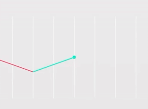

WORK IN PROGRESS

# Vocabulary Learning Application – Documentation & Showcase

> *A full‑stack demo project created as a portfolio piece.*

# 1. Introduction

The **Vocabulary Learning Application** demonstrates end‑to‑end skills in building interactive language‑learning tools. Although **not intended for production**, it illustrates modern front‑end techniques, scalable back‑end services, and algorithmic implementations. The system supports **bidirectional learning between Polish and English**.

# 2. Tech Stack

| Layer         | Technology                 | Key Libraries                                       |
| ------------- | -------------------------- | --------------------------------------------------- |
| **Front‑end** | React 18 + Vite 6          | react‑router‑dom, react‑intl (i18n), Chart.js, GSAP |
| **Back‑end**  | Node + Express             | JWT auth, PostgreSQL via pg‑Promise                 |
| **Testing**   | Vitest + Testing Library   | fake‑indexeddb, jsdom                               |
| **DevOps**    | NPM scripts + Vite preview | *start*, *build*, *test*                            |

# 3. Installation

Instructions to install in the file: **installation.md**

# 4. API

The `API_endpoints.md` file in the repository contains a tabular overview of all REST API endpoints, including the required paths, HTTP methods, and controller functions.

# 5. Main Modules

## 5.1 Flashcards

### Overview

* Implements a **five‑box Leitner system**.
* Each new word starts in **Box 1**; every correct answer moves it to the next box.
* Reaching **Box 5** marks the word as mastered and removes it from the box.
* Any mistake sends the word back to **Box 1**.
* With every promotion the translation direction flips: **PL → ENG**, then **ENG → PL**, and so on.


### Available Features

#### Synchronization

* **Logged‑in users** – progress is stored in the cloud and follows the user across devices.
  If the user makes progress without being logged in (even though they were logged in before), the system detects a version mismatch. After logging in and entering the game, the user is asked if they want to keep the local version or overwrite it with the version from the server.
* **Guest users** – progress persists in `localStorage`; refreshing the page does not reset the session.

#### Interface & Interaction

* **GSAP** animations.
* **Two progress bars**:

  1. **Daily progress** – today’s results.
  2. **Level progress** – overall completion of the current level (B2 / C1).
* **Three buttons:**

  * **Add words** – fetches another 30 words into **Box 1** (capped at 90).
  * **Submit** – checks the current answer.
  * **First letter** – reveals the word’s initial letter.
* Automatic **autofocus** shifts the cursor between input fields for faster typing.

#### Keyboard Shortcuts

* **↑ / ↓** – switch between inputs on the current flashcard.
* **Enter** – submit the answer.
* **← / →** – move between boxes.

#### Visual Feedback

* A correct answer in **Box 5** triggers a **confetti** celebration.
* An incorrect answer makes the flashcard turn red and shows a faint placeholder of the correct word in both languages until re‑typed accurately.


#### Telemetry

* Every visit to the game is logged on the server for usage analytics.

## 5.2 Vocabulary Test

### Overview

* The page fetches **30 words** from the server.
* The user types each translation in sequence.
* A bottom progress bar tracks completion of the current 30‑word batch.
* After the 30th word:

  * A **confetti** animation plays.
  * The server sends the next 30 words.
  * The progress bar resets.
* This loop continues until the user processes every word in the level.


### Page Structure

1. **Top section**

   * **Input field (left)** – user enters the translation.
   * **Animated carousel (right)** – displays the word to translate.
2. **Middle section**

   * **Progress bar** – shows progress through the current 30‑word set.
3. **Bottom section – two buttons**

   1. **Input mode toggle** – switches between:

      * Single input field **or**
      * Two buttons: **“I know” / “I don’t know”**.
   2. **Progress display toggle** – swaps the visible progress bar:

      * **Batch progress** – 30‑word set.
      * **Level progress** – overall completion for the current level (B2 / C1).

### End‑of‑Level Summary

* Two result tables appear:

  * **Left:** incorrectly answered words.
  * **Right:** correctly answered words.
* Displays the **percentage of correct translations**.

TODO wygenerowac gifa z wynikami

## 5.3 Arena

Competitive online mode – the server assigns words based on the current rating (0 – 3 000 pts). Each answer instantly updates the score, and a chart visualises the trend.

### Access

* **Logged‑in users only.** Guests are redirected to the login page.
  *Reason: protects the ranking system.*

### Gameplay Flow

1. The server serves **one word** at a time, selected by the player’s **ranking score (0 – 3000 pts)**.
2. Difficulty mix (B2 vs C1) scales with rank:

```js
const tiers = [
  { max: 500,  B2: 1.0, C1: 0.0 },
  { max: 1000, B2: 0.9, C1: 0.1 },
  { max: 1500, B2: 0.7, C1: 0.3 },
  { max: 2000, B2: 0.5, C1: 0.5 },
  { max: 2500, B2: 0.4, C1: 0.6 },
  { max: 3000, B2: 0.1, C1: 0.9 },
];
```

### Page Layout


#### Top Pane

| Element                 | Functionality                                                                  |
| ----------------------- | ------------------------------------------------------------------------------ |
| **Live score**          | Updates after every answer.                                                    |
| **Language flag**       | Shows translation direction (PL → ENG or ENG → PL).                            |
| **Answer field**        | Single input; submit with **Confirm** button or **Enter**.                     |
| **Current word**        | Displayed directly above the input.                                            |
| **Last answer preview** | Visible above the field: green (correct) or red plus the correct form (wrong). |

#### Bottom Pane

* **Score chart** – animated line graph tracking point trends in real time.


*Before starting the Vocabulary Test or Flashcards, users choose their proficiency level (B2 or C1) as shown above.*
*B2 (\~3 000 words) and C1 (\~2 000 words).*


*Availability: All game modes are available in small windows.*

## 5.4 Settings

### The settings have three tabs:

1. **UI & audio**

   * Sounds – You can enable or disable sounds on the page (from pop‑ups or games, if applicable).
   * Dark mode – Changes the page theme to dark and vice versa.
   * Language – Changes the language.
   * Skins – Changes the logo in the sidebar or the default appearance of the boxes in the Flashcards game.
2. **Gameplay**

   * Ignore diacritics – The checking system ignores diacritical marks (ą, ć, ź, etc.) *Does not work in the arena!*
   * Typo tolerance – You can make one mistake. *Does not work in the arena!*
   * Daily goal – You can adjust the daily goal in the Flashcard Game.
3. **Reset**

   * Restore default settings
   * Reset Flashcard/Test progress (B2/C1 separately)


## 5.5 Account Settings

Change e‑mail, nickname, password and one of four avatars (used in leaderboards). Option for permanent account deletion.


## 5.6 Admin Panel

Administrative dashboard available at `/admin` for users with the **admin** role only. The sidebar exposes four main sections and a separate **Reshuffle** action:

1. **Main** – high‑level statistics
   * **Counters** for total users, reports, languages and words (with B2/C1 breakdown).
   * **Today’s activity**: number of logins and visits to Flashcards and Vocabulary pages.
   * **Charts** showing new registrations and overall page views.
   * The sidebar button **Reshuffle** (PIN protected) lives here and regenerates word patches used in all games.
2. **Reports** – translation issue management
   * **Sortable table** listing user‑submitted problems with type, short description and date.
   * Clicking a row opens **detailed view** where translations can be edited in place.
   * Reports may be saved with the new wording or removed entirely after confirmation.
3. **Words** – vocabulary database
   * **Search bar** with instant results for quick lookup by ID or word.
   * **Infinite‑scroll table** of all words; selecting a row opens the editable details panel.
   * Admins can **edit translations and descriptions**, switch between B2 and C1, or **delete** a word.
   * The “new word” button launches a form to add fresh entries to the system.
4. **Users** – account management
   * **Search** by ID, nickname or e‑mail with auto scrolling to the result.
   * **Inline editing** of username, email, ranking ban and role; each change can be confirmed or undone.
   * A “Confirm Changes” button sends all edits to the server, while the trash icon removes a user account.


# 6. Other Important Components

## 6.1 Popup

### Overview

- **PopupProvider** wraps the app and supplies a `PopupContext` with `setPopup`.
    
- **NewPopup** renders the current message in a portal attached to `#portal-root`.
    
- **popupManager.js** exposes `showPopup()` so components and utilities can trigger popups without importing the context.
    
  

### Usage

1. Import and call `showPopup()` with a message and optional options:
    

```js
import { showPopup } from "./utils/popupManager";

showPopup({
  message: "Saved successfully!",
  emotion: "positive",   // "positive", "negative", "warning" or "default"
  duration: 3000          // milliseconds
});
```

2. Inside the provider, `NewPopup` automatically hides after the **duration** and calls `onClose` to clear the message. When sounds are enabled in **Settings**, an audio cue matching the emotion plays.
    
3. If the message string begins with `ERR_`, React‑Intl looks up the translation key and renders the localized text.
    

The popup system provides consistent user feedback across the application, including API error handling and form validation.

## 6.2 ProgressBar

The **ProgressBar** component renders a graphical indicator of completion. It accepts three props:

1. **vertical** – boolean (default `false`). When `true`, the bar fills **top‑to‑bottom**; otherwise **left‑to‑right**.
    
2. **percent** – number (0 – 100) representing the fill percentage. Together with `vertical`, it controls the gradient direction:
    


```jsx
style={{
  // Use a CSS gradient to fill the bar up to `percent`
  "--progress-gradient": vertical
    ? `linear-gradient(to top, var(--highlight) ${percent}%, var(--secondary) ${percent}%)`
    : `linear-gradient(to right, var(--highlight) ${percent}%, var(--secondary) ${percent}%)`,
}}
```

3. **text** – optional label. Rendered next to the bar only when provided and styled per orientation:
    

```jsx
<div className={`progress-container ${vertical ? "progress-container-vertical" : ""}`}>
  {text && (
    <span className={`progress-text ${vertical ? "progress-text-vertical" : ""}`}>{text}</span>
  )}
</div>
```

## 6.3 Confetti

An overlay emits small confetti pieces to celebrate milestones. It covers the viewport but ignores pointer events.

### Implementation Details

- Located in `frontend/src/components/confetti/confetti.jsx` with styles in `confetti.css`.
    
- When `generateConfetti` is `true`, 20 `<div class="confetti">` elements spawn every 300 ms:
    
  

```jsx
const total = 20;
if (generateConfetti) {
  interval = setInterval(() => {
    const newConfetti = Array.from({ length: total }, (_, i) => <div className="confetti" key={i} />);
    setConfettiElements(prev => [...prev, ...newConfetti]);
  }, 300);
}
```

- Each element animates via `offset-path`, randomising colour and timing:
    

```css
.confetti::before {
  background-color: hsl(var(--color));
  animation: confetti 2s cubic-bezier(0.5, 0, 0.5, 1) both,
             confetti-opacity 2s cubic-bezier(0.5, 0, 0.5, 1) both;
  offset-path: padding-box;
}
```

- Generation stops after ≈2 s; the overlay disappears after ≈4 s.
    

#### Triggers

- Clearing **Box 5** in Flashcards.
    
- Completing each 30‑word batch in Vocabulary Test.
    

## 6.4 ScrambledText

**ScrambledText** is a lightweight component that animates the transition between strings by scrambling characters.

1. `scramble` starts a `setInterval` that runs every `interval` (default **30 ms**) and updates the display.
    
2. During the first phase, the visible length interpolates from the previous string to the target:
    


```jsx
const currentLength = Math.round(fromLength + (toLength - fromLength) * progress);
```

3. Positions that are not yet final display random characters from `ABCDEFGHIJKLMNOPQRSTUVWXYZ0123456789`:
    

```jsx
let result = "";
for (let i = 0; i < currentLength; i++) {
  if (i < toLength && progress >= (i + 1) / toLength) {
    result += toText[i];
  } else {
    result += i < toLength ? CHARACTERS[Math.floor(Math.random() * CHARACTERS.length)] : "";
  }
}
```

4. After `duration` (default **1500 ms**), the interval stops and the target text is fully rendered.
    
## 6.5 Arena Chart

The competitive **Arena** mode features a lightweight chart that visualizes your
ranking points. The `MyCustomChart` component receives an array of scores and
renders up to the last ten values on a 400×200 SVG canvas.

- **Location:** `frontend/src/components/arena/chart.jsx` with styling rules in
  `arena.css`.
- **Scaling:** points are normalised to the current 500‑point bracket so the
  graph stays centered on your recent progress.
- **Colours:** rising segments use the `line-up` class while drops use
  `line-down`. The final score is marked with a circle coloured to match the last
  segment (`circle-up`/`circle-down`).
- **Updates:** the chart lives under the game view and refreshes after each
  answer you submit.



## 6.6 VocaTest Summary

After finishing a vocabulary level, the **ResultsSummary** screen presents a
detailed breakdown of your answers.

- **Location:** `frontend/src/components/voca/summary/resultssummary.jsx` with
  auxiliary components in the same folder.
- **Intro text:** before the results appear, a short message
  “you have finished all parts! :D” types itself out as an animation.
- **Progress:** a bar shows the overall percentage of correct translations.
- **Tables:**
  - **Good results** – correctly typed words.
  - **Wrong results** – mistakes to review.
- **Buttons:** colour‑coded controls switch between tables and reset your
  progress. They only appear on narrow screens (under 768 px), where one table
  is displayed at a time.


## 6.7 Auto-save / Auto-load

Flashcard progress can be saved to the browser and, for logged-in users, synced
to the server. The logic lives inside the `useBoxesDB` hook.

- **Hook location:** `frontend/src/hooks/boxes/useBoxesDB.jsx`.
- **Saving:** when the `autoSave` flag becomes `true`, data is pushed to the
  `/user/auto-save` endpoint (if logged in) and always mirrored into IndexedDB.
- **Loading:** on mount, the hook requests `/user/auto-load` and resolves
  conflicts using timestamps stored in `localStorage`.
- **Cleanup:** calling `/user/auto-delete` removes the stored progress after a
  level is completed.

```jsx
const serverAutosave = useCallback(async () => {
  const currentPatch = lvl === "B2" ? patchNumberB2 : patchNumberC1;
  const words = Object.entries(boxes)
    .flatMap(([boxName, items]) => items.map(({ id }) => ({ id, boxName })));

  await api.post("/user/auto-save", {
    level: lvl,
    deviceId,
    words,
    patchNumber: currentPatch,
  });
}, [boxes, lvl, deviceId, patchNumberB2, patchNumberC1]);

useEffect(() => {
  const saveData = async () => {
    if (!autoSave) return;
    if (isLoggedIn) await serverAutosave();
    // persist to IndexedDB ...
    setAutoSave(false);
  };
  saveData();
}, [autoSave, boxes, lvl, isLoggedIn, serverAutosave]);
```


### TO DO

- Admin panel
    
- Centralized API error handling
    
- Persisted user settings
    
- Auto‑save / auto‑load system
    
- `useSpellchecking` hook
    
- Authorization system
    
- Database schema documentation
    
- Reporting system